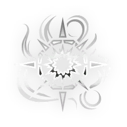
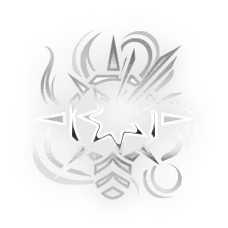

# Burston — Incarnon Genesis

> **Variantes:** Burston · Burston Prime
> Fuente: https://wiki.warframe.com/w/Burston_Incarnon_Genesis
> Fuente actualizada: 2026-04-30
> Raw: burston-incarnon-genesis.wikitext

---

## EVO 1 — Incarnon Form

**Descripción:**
- Weakpoint hits charge Incarnon Transmutation; Alt Fire transmutes. Switching back will expend any remaining charge.
- Gain an Auto Fire mode and deal Radial <DT_HEAT> Damage.

**Notas:**
- Incarnon Form becomes fully automatic dealing pure <DT_HEAT> damage with shots exploding in a **2** meter area of effect, with much higher Critical Chance, Critical Multiplier, and Fire Rate. However, it deals much less base damage, the explosion possesses Damage Falloff from **100%** to **0%** from central impact, and reduced Zoom.
- The Radial Attack does not benefit from Multishot bonuses and has a Headshot multiplier of 1x.
- On Punch Through Radial Attack will hit only first enemy or be stopped if fired through an obstacle.

---

## EVO 2

**Challenge:** Complete a solo mission with this weapon equipped.

### Forceful Finality

**Efectos:**
- Increase Base Damage by **+42**.
- **+5** Base Multishot on final magazine burst.

| Variante | Valor |
|----------|-------|
| Burston | - |
| Burston Prime | - |

**Notas:**
- Multishot bonus is added before mods, and is thus multiplied by multishot bonuses.
- Multishot bonus does not affect the Incarnon form.

### Fortress Salvo

**Efectos:**
- Increase Base Damage by **+42**.
- With Armor Over **450**: **+2** Punch Through.

| Variante | Valor |
|----------|-------|
| Burston | - |
| Burston Prime | - |

---

## EVO 3

**Challenge:** Kill **100** enemies with this weapon's Incarnon Form.

### Extended Volley

**Efectos:**
- Increase Base Magazine Capacity by **+21**.

| Variante | Valor |
|----------|-------|
| Burston | - |
| Burston Prime | - |

### Kinetic Battle

**Efectos:**
- **-50%** Weapon Recoil.

| Variante | Valor |
|----------|-------|
| Burston | - |
| Burston Prime | - |

---

## EVO 4

**Challenge:** Get **40** weakpoint hits with this weapon in Incarnon form in a single mission.

### Reaver's Rapture

**Efectos:**
- On Full Burst Hit: **+20%** Damage, resets on Reload.

| Variante | Valor |
|----------|-------|
| Burston | - |
| Burston Prime | - |

**Notas:**
- Caps at **5x** for **+100%** damage, additive with base damage mods such as Serration.
- Burst condition is not affected by multishot or punch through, but counts object hits such as nullifier bubbles, and activates even if the first hit of a burst kills the target.
- Resets when activating incarnon, and cannot be stacked in Incarnon form.

### Absolute Valor

**Efectos:**
- Increase Base Critical Chance by **+22%**.

| Variante | Valor |
|----------|-------|
| Burston | - |
| Burston Prime | - |

### Fatal Affliction

**Efectos:**
- **+40%** Direct Damage per Status Type affecting the target.

| Variante | Valor |
|----------|-------|
| Burston | - |
| Burston Prime | - |
