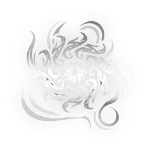
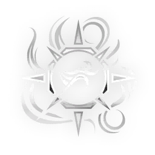

# Latron — Incarnon Genesis

> **Variantes:** Latron · Wraith · Prime
> Fuente: https://wiki.warframe.com/w/Latron_Incarnon_Genesis
> Fuente actualizada: 2026-04-30
> Raw: latron-incarnon-genesis.wikitext

---

## EVO 1 — Incarnon Form

**Descripción:**
- Weakpoint hits charge Incarnon Transmutation; Alt Fire transmutes. Switching back will expend any remaining charge.
- Fire <DT_HEAT> Damage energy waves that bounce off enemies and terrain.

**Notas:**
- Incarnon Form changes the weapon's fire mode from hitscan to a traveling projectile that can ricochet off enemies and terrain, exploding up to **6** times with a **4** meter radius, dealing damage once for any collision on enemies, and again for the explosion.
- Collision deals <DT_IMPACT> damage and have a guaranteed <DT_IMPACT> proc.
- Explosion deals <DT_PUNCTURE> and <DT_HEAT> damage, and can benefit from Firestorm (Primed).
- Each ricochet will cause the projectile to slow down.
- Bullet attraction bubbles such as Magnetize or <DT_VOID> status will cause the projectile to orbit within until exploding at the end of its life, and seem to require multiple enemies to ricochet repeatedly.
- Incarnon Form has no Recoil, higher total damage, Critical Chance, Critical Multiplier, and Status Chance. However its <DT_SLASH> damage is removed, the Fire Rate is reduced, and the explosion possesses Damage Falloff from 100% to 80% from central impact.
- Punch Through does not affect the incarnon projectile.
- Double Tap affects Incarnon Form.

---

## EVO 2

**Challenge:** Complete a solo mission with this weapon equipped.

### Riddled Target

**Efectos:**
- Increase Base Damage by **+X**.
- On <DT_PUNCTURE> Status Effect: **+25%** Multishot for **8s**. Stacks up to **4x**.

| Variante | Valor |
|----------|-------|
| Latron | X = 48 |
| Wraith | X = 12 |
| Prime | X = 6 |

**Notas:**
- The multishot bonus stacks additively with mods such as Split Chamber.

### Swift Punishment

**Efectos:**
- Increase Base Damage by **+X**.
- With Sprint Speed 1.2 or Higher: **+30%** Direct Damage per Status Type affecting the target.

| Variante | Valor |
|----------|-------|
| Latron | X = 48 |
| Wraith | X = 12 |
| Prime | X = 6 |

**Notas:**
- Despite the description, the effect only requires **1.1** or higher sprint speed.
- Equipping Amalgam Serration will allow any Warframe to reach the threshold without needing to mod for sprint speed on the Warframe itself.

---

## EVO 3

**Challenge:** Kill **100** enemies with this weapon's Incarnon Form.

### Marksman's Hand

**Efectos:**
- **-60%** Weapon Recoil.

| Variante | Valor |
|----------|-------|
| Latron | - |
| Wraith | - |
| Prime | - |

### Extended Volley

**Efectos:**
- Increase Base Magazine Capacity by **+15**.

| Variante | Valor |
|----------|-------|
| Latron | - |
| Wraith | - |
| Prime | - |

### Marksman's Focus

**Efectos:**
- **-30%** Zoom.

| Variante | Valor |
|----------|-------|
| Latron | - |
| Wraith | - |
| Prime | - |

---

## EVO 4

**Challenge:** Kill **30** enemies that are least **40m** away.

### Flensing Spikes

**Efectos:**
- Remove **20%** of enemy Armor per <DT_PUNCTURE> Status.

| Variante | Valor |
|----------|-------|
| Latron | - |
| Wraith | - |
| Prime | - |

**Notas:**
- Has no effect on enemies immune to armor removal, such as Exploiter Orb or Archons.
- Can fully strip Acolytes' armor, though they cannot have more than four Puncture status stacks at once.

### Deadhead

**Efectos:**
- **+100%** Headshot Damage.

| Variante | Valor |
|----------|-------|
| Latron | - |
| Wraith | - |
| Prime | - |

**Notas:**
- The bonus stacks additively with other headshot multiplier bonuses such as the passive from Primary Deadhead.

### Critical Parallel

**Efectos:**
- Increase Base Critical Chance by **+X%**.
- Increase Base Critical Damage Multiplier by **+Yx**.

| Variante | Valor |
|----------|-------|
| Latron | X = 30% / Y = 0.6x |
| Wraith | X = 24% / Y = 0.2x |
| Prime | X = 24% / Y = 0.2x |
