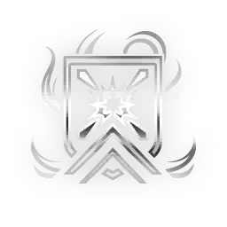

# Paris — Incarnon Genesis

> **Variantes:** Paris · Mk1-Paris · Paris Prime
> Fuente: https://wiki.warframe.com/w/Paris_Incarnon_Genesis
> Fuente actualizada: 2026-06-23
> Raw: paris-incarnon-genesis.wikitext

---

## EVO 1 — Incarnon Form

**Descripción:**
- Weakpoint hits charge Incarnon Transmutation; Alt Fire transmutes. Switching back will expend any remaining charge.
- Sacrifice silence for increased projectile size and <DT_HEAT> Damage.

**Notas:**
- Incarnon Form fires a wide projectile that deals <DT_HEAT> damage, with significantly increased base damage, Critical Chance, and Critical Multiplier, and infinite body Punch Through. However, it no longer deals <DT_PUNCTURE> or <DT_SLASH> damage, has a headshot multiplier of 1x, and has slightly slower charge time.

---

## EVO 2

**Challenge:** Complete a solo mission with this weapon equipped

### Deadly Pace

**Efectos:**
- Increase Base Damage by **+X**.
- With Sprint Speed 1.2 or Higher: **+80%** Fire Rate.

| Variante | Valor |
|----------|-------|
| Paris | X = 40 |
| Mk1-Paris | X = 50 |
| Paris Prime | X = 20 |

**Notas:**
- The fire rate bonus stacks additively with fire rate mods such as Speed Trigger but does not apply twice.
- Despite the description, the effect only requires **1.1** or higher sprint speed.
- Equipping Amalgam Serration will allow any Warframe to reach the threshold without needing to mod for sprint speed on the Warframe itself.

### Guardian's Might

**Efectos:**
- Increase Base Damage by **+X**.
- With Overshields: Increase Base Damage by **+Y**.

| Variante | Valor |
|----------|-------|
| Paris | X = 40 / Y = 52 |
| Mk1-Paris | X = 50 / Y = 40 |
| Paris Prime | X = 20 / Y = 74 |

---

## EVO 3

**Challenge:** Kill **100** enemies with this weapon's Incarnon Form

### Ardent Trigger

**Efectos:**
- On Punch Through Hit: **+40%** Fire Rate for **6s**.

| Variante | Valor |
|----------|-------|
| Paris | - |
| Mk1-Paris | - |
| Paris Prime | - |

**Notas:**
- The fire rate bonus stacks additively with fire rate mods such as Speed Trigger but does not apply twice.
- The bonus applies when hitting multiple enemies with either the normal or the Incarnon form as well as when hitting enemies through obstacles by adding punch through with mods such as  Metal Auger.

### Markman's Focus

**Efectos:**
- **-30%** Zoom.

| Variante | Valor |
|----------|-------|
| Paris | - |
| Mk1-Paris | - |
| Paris Prime | - |

### Swift Deliverance

**Efectos:**
- **+60%** Projectile Speed.

| Variante | Valor |
|----------|-------|
| Paris | - |
| Mk1-Paris | - |
| Paris Prime | - |

---

## EVO 4

**Challenge:** Kill **60** enemies while being at least **4m** above them

### Vicious Promise

**Efectos:**
- Increase Base Critical Chance by **+40%** on undamaged enemies.
- Increase Base Critical Damage Multiplier by **+2x** on undamaged enemies.

| Variante | Valor |
|----------|-------|
| Paris | - |
| Mk1-Paris | - |
| Paris Prime | - |

**Notas:**
- Enemies are undamaged as long as their health and shield have not been damaged.
- Damaging <DT_OVERGUARD> is not taken into account.

### Elemental Balance

**Efectos:**
- Increase Base Status Chance by **+60%.**

| Variante | Valor |
|----------|-------|
| Paris | - |
| Mk1-Paris | - |
| Paris Prime | - |

### Striking Succession

**Efectos:**
- On Hit: Increase Base Damage by **+15** for **3s**. Stacks up to **4x**.

| Variante | Valor |
|----------|-------|
| Paris | - |
| Mk1-Paris | - |
| Paris Prime | - |

**Notas:**
- When the buff times out, one stack is lost and the buff duration resets.
