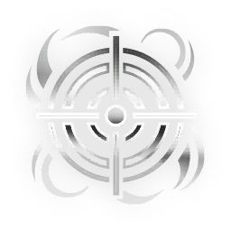

# Phenmor — Incarnon Genesis

> Fuente: https://wiki.warframe.com/w/Phenmor
> Fuente actualizada: 2026-07-31
> Raw: phenmor.wikitext

---

## EVO 1 — Incarnon Form

**Descripción:**
- Weakpoint Hits charge Incarnon Transmutation; Alt Fire transmutes. Switching back will expend any remaining charge.

**Notas:**
- Incarnon Form changes the weapon from a semi-auto to full-auto with increased fire rate, 3 meter punch through, and its shots inflict <DT_RADIATION> and <DT_SLASH> damage but no longer inflicts <DT_PUNCTURE> damage.
- Incarnon Form uses Archgun animations. Contrary to its appearance, the Phenmor is still considered a Primary weapon and will not impair Aim Glide time.
- Incarnon Form's fire rates spools down from **100%** to **60%** over **51** shots as the trigger is held. Spool resets once the player stops firing, encouraging brief bursts of fire rather than sustained fire.

**Challenge:** Kill **100** enemies with the Phenmor.

---

## EVO 2

**Challenge:** Kill **8** Eximus with the Phenmor's Incarnon Transmutation.

### Void's Guidance

**Efectos:**
- **+50%** Accuracy and **+50%** less Recoil while Aiming

### Rapid Wrath

**Efectos:**
- **+20%** Fire Rate

### Swift Deliverance

**Efectos:**
- **+80%** Projectile Speed

---

## EVO 3

**Challenge:** Land **20** headshots on Void Angels with Primary fire without reloading.

### Retribution's Vessel

**Efectos:**
- **+50%** Magazine Capacity

**Notas:**
- Does not affect Incarnon Form.

### Ready Retaliation

**Efectos:**
- On Reload from Empty: **+100%** Reload Speed for **6** seconds

**Notas:**
- Affects untransformed Phenmor. Can affect transition into Incarnon form with a well-timed manual reload. Does not affect transition from Incarnon back to base form.

### Executioner's Fortune

**Efectos:**
- On Headshot kill: **20%** chance to instant Reload.

**Notas:**
- Does not affect Incarnon Form

---

## EVO 4

**Challenge:** Close **12** Ruptures in Void Flood

### Survivor's Edge

**Efectos:**
- **+10%** Critical Chance
- **+10%** Status Chance

**Notas:**
- Bonuses are added after mods as a flat value.

### Incarnon Efficiency

**Efectos:**
- Headshots Build **+50%** more Incarnon Transmutation charge.

**Notas:**
- Reduces the number of weakpoint hits required to fully charge Transmutation to **8**.
- Each weakpoint hit generates **51** charge, up from **34**.

### Elemental Excess

**Efectos:**
- **+20%** Status Chance
- **-10%** Critical Chance

**Notas:**
- Bonuses are added after mods as a flat value.

---

## EVO 5

**Challenge:** Complete a Solo mission with an Incarnon Weapon equipped in every slot.

### Devastating Attrition

**Efectos:**
- **50%** chance to deal **+2000%** damage on non-critical hits

**Notas:**
- Affects both forms.
- Damage bonus is multiplicative to base damage bonuses such as Serration.

### Spiteful Defilement

**Efectos:**
- Enemies suffering from fewer than **3** Status Effects will receive: **+100%** Critical Damage

**Notas:**
- Bonus is added after mods as a flat value.
- Multiple instances of the same status effect are not counted separately, e.g. having 5 corrosive and 5 radiation status effects on a target will not disable this buff.

### Lingering Judgement

**Efectos:**
- On **2** headshots within **2** seconds: **+50%** Headshot damage for **8** seconds.

**Notas:**
- Headshot damage bonus stacks additively Primary Deadhead headshot damage bonus.
