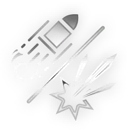

# Felarx — Incarnon Genesis

---

## EVO 1 — Incarnon Form

**Descripción:**
- Weakpoint Hits charge Incarnon Transmutation; Alt Fire transmutes. Switching back will expend any remaining charge.

**Notas:**
- Incarnon Form changes the weapon to semi-automatic and fires large energy projectiles with higher accuracy and critical multiplier, **0.5** meter punch through, and its status chance per projectile is increased to **20%**. However, its shots inflict <DT_RADIATION> and <DT_IMPACT> damage instead of <DT_PUNCTURE> and <DT_SLASH>, it loses shotgun multishot mechanics and has a base multishot of 1, and its fire rate and total damage are reduced.
- Despite the explosive visual effect, there is no radial damage.
- As the per-shell reload makes the Felarx be able to interrupt it's reload while firing, the switching can also be interrupted.

**Challenge:** Kill **100** enemies with the Felarx.

---

## EVO 2

**Challenge:** Kill **8** Eximus with the Felarx's Incarnon Transmutation.

### Attuned Accuracy

**Efectos:**
- **+40%** Accuracy when Aiming.

### Kinetic Baffle

**Efectos:**
- **-50%** Weapon Recoil

**Notas:**
- Only applies while aiming.

### Frictionless Flight

**Efectos:**
- **+50%** Projectile Speed

**Notas:**
- Only applies while aiming.

---

## EVO 3

**Challenge:** Land **20** headshots on Void Angels with Primary fire without reloading.

### Dual-Mode

**Efectos:**
- Reload toggles the weapon between **+100%** Projectile Speed and **+4m** Punch Through.

**Notas:**
- Toggles for every shell loaded. For example, reloading all 6 shells will toggle 6 times, leaving it on the mode it started on.
- "Reload when holstered" effects **do** toggle Dual-Mode Chamber.
- Reloading via Garuda's Blood Forge or Cyte-09's Resupply does **not** switch chamber mode.
- Affects Incarnon Form.

### Evolved Autoloader

**Efectos:**
- **+50%** Magazine Reloaded/s when Holstered

### Mounting Momentum

**Efectos:**
- Reload increases Fire Rate by **+10%** per shell. Resets on reload.

**Notas:**
- Increasing Magazine size increases the potential bonus, but also the reload time as shells are loaded individually.
- Stacks up to 99x (+990% Fire Rate).
- Affects Incarnon Form.
- Activating Incarnon Form will add one stack to the counter. Deactivating Incarnon Form will reload the normal form's magazine while retaining stacks; this allows stacks to be sustained and built for as long as Incarnon charge can be built without reloading.
- Deactivating Incarnon Form will also add stacks to the counter for each remaining unit of ammo missing from the magazine when Incarnon Form was activated. For example, if Incarnon Form is activated with 4 shells spent from the magazine and 10 stacks, deactivating Incarnon Form results in a total of 14 stacks.
- Holstering will reset stacks.
- "Reload when holstered" effects such as Lock and Load will build stacks after resetting.
- Reloading via Garuda's Blood Forge does **not** reset nor build stacks. Reloading via Cyte-09's Resupply however **will** build 1 stack.

---

## EVO 4

**Challenge:** Close **12** Ruptures in Void Flood.

### Brutal Edge

**Efectos:**
- **+10%** Critical Chance
- **+10%** Status Chance

**Notas:**
- Bonuses are added after mods as a flat value.
- Status Chance bonus is divided by the base multishot of 4, for only +2.5% Status Chance per pellet.

### Incarnon Catalyst

**Efectos:**
- Headshots Build **+50%** more Incarnon Transmutation charge.

**Notas:**
- Reduces the number of headshots required to fully charge Transmutation to **20**.
- Each headshotting-bullet generates **3** charge, up from **2**.

### Racking Wrath

**Efectos:**
- **+20%** Status Chance
- **-10%** Critical Chance

**Notas:**
- Bonuses are added after mods as a flat value.
- Status Chance bonus is divided by the base multishot of 4, for only +5% Status Chance per pellet.

---

## EVO 5

**Challenge:** Complete a Solo mission with an Incarnon Weapon equipped in every slot.

### Devastating Attrition

**Efectos:**
- **50%** chance to deal **+2000%** damage on *non-critical* hits

**Notas:**
- Affects both forms.
- Damage bonus is multiplicative to base damage bonuses such as Serration.

### Ruptured Plentitude

**Efectos:**
- On Punch Through **3** enemies: **+70%** Ammo Efficiency for **20s**

### Agile Executor

**Efectos:**
- Gain **50%** Ammo Efficiency while Aim Gliding and Sliding
